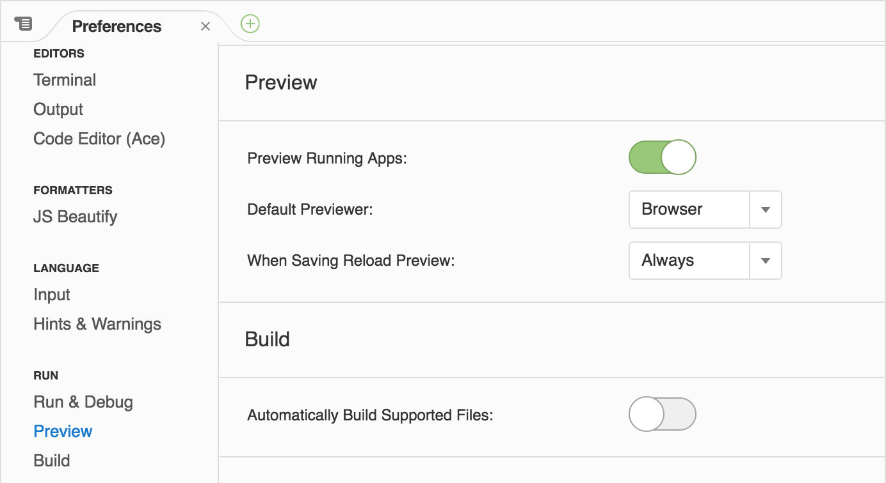

# [Cloud9](https://c9.io) [Elm](http://elm-lang.org/) Workspace Setup

#### Install Elm through [npm](https://www.npmjs.com/package/elm)
```
npm install --global elm

```

#### Create Elm Project
```
elm package install
...
Do you approve of this plan? (y/n) y

```
Approve the plan by entering 'y'

elm-package.json would be created

### Change elm-package.json
```json
{
    "version": "1.0.0",
    "summary": "helpful summary of your project, less than 80 characters",
    "repository": "https://github.com/user/project.git",
    "license": "BSD3",
    "source-directories": [
        "src"
    ],
    "exposed-modules": [],
    "dependencies": {
        "elm-lang/core": "4.0.0 <= v < 5.0.0"
    },
    "elm-version": "0.17.0 <= v < 0.18.0"
}
```
source-directories needs to change to match files when importing

#### Install any [packages](http://package.elm-lang.org/)
```
elm package install elm-lang/html -y
elm package install elm-lang/svg -y
elm package install elm-lang/keyboard -y
```

#### Run Server [Elm Reactor](https://github.com/elm-lang/elm-reactor)
```
elm reactor --address 0.0.0.0 --port 8080

```


#### Open in Preview Browser
```
https://{workspace-name}-{username}.c9users.io

```

#### Reactor messing with src/Main.elm
```
https://{workspace-name}-{username}.c9users.io/src/Main.elm

```

#### For automatic reload within C9
Update Setting Preferences 
-> USER SETTINGS
-> Run
-> Preview

Toggle "Preview Running Apps:" to be active

Set "When Saving Reload Preview:" to "Always"




#### Compiling elm
```
elm make src/Main.elm --output build/index.html

```

#### Compiling elm.js
```
elm make src/Main.elm --output build/elm.js

```
